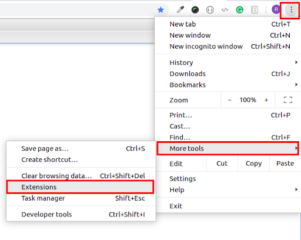
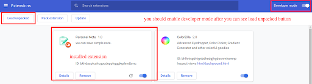

## Personal Note
<p align="center">  </p>

## How to create browser extension?

- **What is Browser extension?**

An extension is a  mini software tool for modifying a web browser. 
many extensions are available, including user interface,modification,add blocking and screenshot.


- **How can we make extension?**

it is easy to create your own extension.We need to required manifest.json file and other html,script,css and required image or icon.

**You must create manifest.json file in root directory**
```
{
  "manifest_version": 2,
  "name": "Personal Note",
  "description": "its simple to save note.",
  "version": "1.0",
  "auther":"Ramesh Vaniya",
  "icons": {
    "64": "icons/icon64x64.png"
  },
  "browser_action": {
    "default_icon": "icons/icon64x64.png",
    "default_popup": "popup.html"
  },
  "background": {
    "page": "background.html"
  },
  "permissions": [
    "identity"
  ],
  "content_security_policy":"script-src 'self' https://www.gstatic.com/ https://*.firebaseio.com https://www.googleapis.com; object-src 'self'",
  "oauth2": {
    "client_id": "client.apps.googleusercontent.com",
    "scopes": [
      "https://www.googleapis.com/auth/userinfo.email",
      "https://www.googleapis.com/auth/userinfo.profile"
    ]
  },
  "key":"extension public key"
}

```
## Upload extension in your local browser (Google chrome)

- Please follow below image for open extension list.


- You need to allow development mode in google chrome.


## Upload extension in your local browser (Firefox)

- Please follow below image for open extension list.


- **Installed extension**


[You can get our extension from firefox store](https://addons.mozilla.org/en-US/firefox/addon/personal-note)

[You can get our extension from google chrome store](https://chrome.google.com/webstore/detail/bbcencfbimebbbmlpaokmndbegmecghd)

</p>

[You can check full detail about it. you can open our blog](https://www.logisticinfotech.com/blog/handle-different-types-user-role-laravel).
