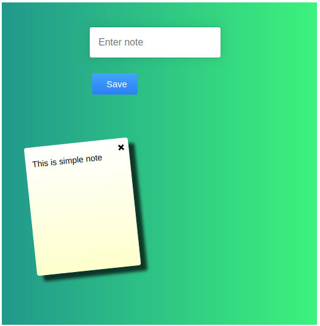
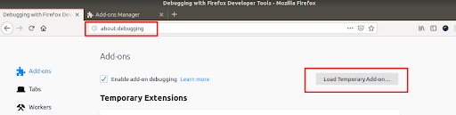
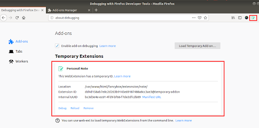

##How to create browser extension?

-what is Browser extension?

An extension is a  mini software tool for modifying a web browser. 
many extensions are available, including user interface,modification,add blocking and screenshot.

-how can we make extension?

it is easy to create your own extension.We need to required manifest.json file and other html,script,css and required image or icon.

you must create manifest.json file in root directory

{
  "manifest_version": 2,
  "name": "Personal Note",
  "description": "its simple to save note.",
  "version": "1.0",
  "auther":"Ramesh Vaniya",
  "icons": {
    "64": "icons/icon64x64.png"
  },
  "browser_action": {
    "default_icon": "icons/icon64x64.png",
    "default_popup": "popup.html"
  },
  "background": {
    "page": "background.html"
  },
  "permissions": [
    "identity"
  ],
  "content_security_policy":"script-src 'self' https://www.gstatic.com/ https://*.firebaseio.com https://www.googleapis.com; object-src 'self'",
  "oauth2": {
    "client_id": "client.apps.googleusercontent.com",
    "scopes": [
      "https://www.googleapis.com/auth/userinfo.email",
      "https://www.googleapis.com/auth/userinfo.profile"
    ]
  },
  "key":"extension public key"
}

## upload extension in your local browser (Google chrome)

- please follow below image for open extension list.

- you need to allow development mode in google chrome.

## upload extension in your local browser (Firefox)

- please follow below image for open extension list.

- installed extension

[our extension in firefox store]
(https://addons.mozilla.org/en-US/firefox/addon/personal-note)

[You can check full detail about it. you can open our blog](https://github.com/logisticinfotech/laravel-user-role-base-permision-without-any-package).
